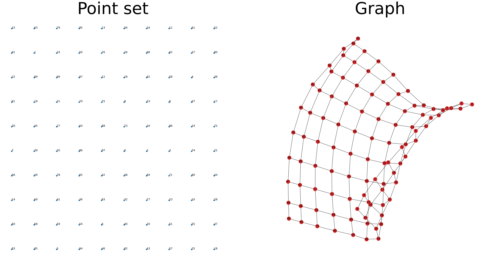
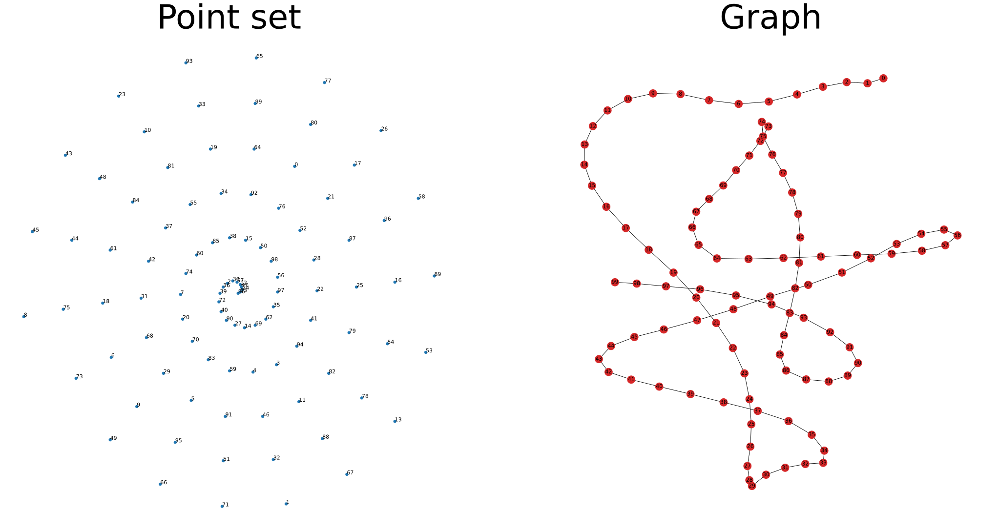
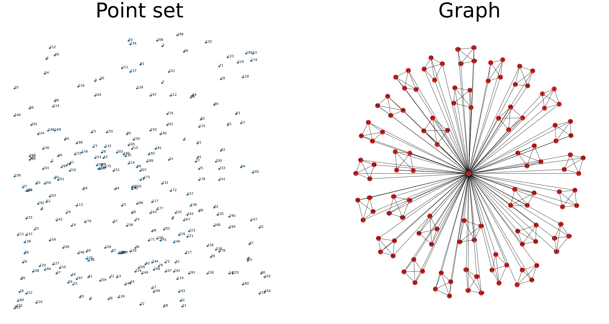
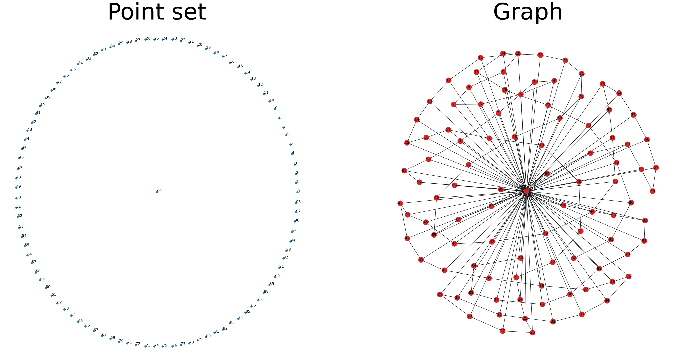
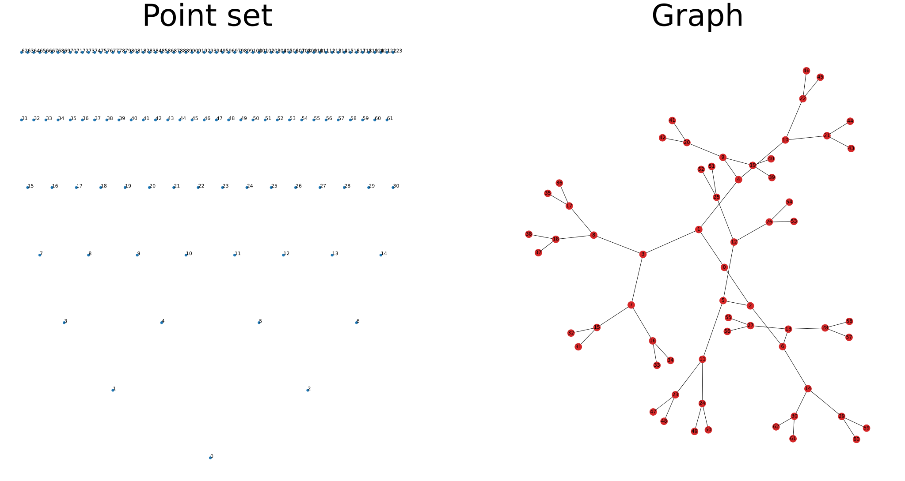
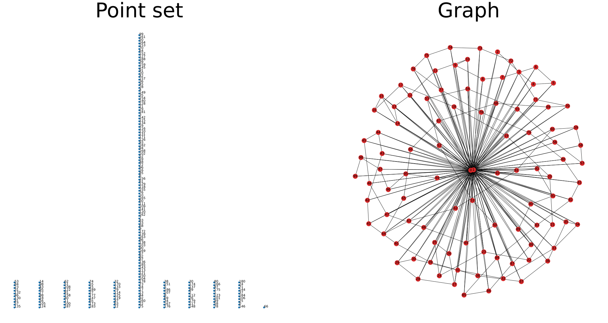

## Problem Definition

Given a topology graph $G = (V, E)$ where $V$ is the vertex set and $E \subseteq V \times V$ is the edge set. The graph has $n$ vertices and $m$ edges. 

Given a set $P \subset \mathbb{R}^2$ of <b>general</b> points  where $|P| \geq n$.

The point set embedding problem ask for an <b>injective</b> function $f: V \to P$ such that no vertex is crossed by an edge when the graph is drawn folowing the function $f$.

<table align="center">
  <tr>
    <td align="center">
      
    </td>
    <td align="center">
      
    </td>
  </tr>
  <tr>
    <td align="center">
      
    </td>
    <td align="center">
      
    </td>
  </tr>
  <tr>
    <td align="center">
      
    </td>
    <td align="center">
      
    </td>
  </tr>
</table>

This problem is a more restrictive version of [Crossing-Minimal Point-Set Embedding](https://mozart.diei.unipg.it/gdcontest/2024/live/).

## What does this tool do?

This is basically blazingly fast CUDA code that test randomly settings in an evolutionary fashion to find feasible $f$.

Given the brute-force nature of the algorithm, at most $|V| < 20000$ can be optimized on a RTX 2080ti with 12GB RAM. 

But if the problem instance fits on the graphic card, this code will be fast, really fast.

Beside the brute force algorithm this code also provides a Integer Linear Programming solution to the problem, which would fail around $|V| \approx 20$.

## Examples

Visualize problems and save the images in `out/problems`

```bash
./tools/visualize_problem.py
```

Visualize solutions and save the images in `out/solutions`

```bash
./tools/visualize_solution.py
```

Find a solution and optimize until user interrupts (recommended)
```bash
./build-release/honeybadger random -input problems/example_problem_1.json
```

Give the nearest neighbor solver some hint to solve an instance where there is only a solution if vertex 0 is assigned 
to point 99

```bash
./build-release/honeybadger nearest -i problems/example_problem_1.json -f 0 99
```

## Dependencies (Ubuntu 20.04/22.04)
- C++ compiler
```bash
sudo apt install gcc-10 g++-10 -y
```

- CMake 3.25.2
```bash
sudo snap install cmake --channel=3.25.2/stable --classic
```

- CUDA driver 525

- CUDA 12
```bash
wget https://developer.download.nvidia.com/compute/cuda/12.0.0/local_installers/cuda_12.0.0_525.60.13_linux.run
sudo sh cuda_12.0.0_525.60.13_linux.run --toolkit --toolkitpath=/opt/cuda
```

## Optional dependencies
- ccache for faster compiling time
```bash
sudo apt install ccache -y
sudo /usr/sbin/update-ccache-symlinks
ccache -F 0
ccache -M 0
```

- Gurobi solver for ILP
```bash
wget https://packages.gurobi.com/9.5/gurobi9.5.2_linux64.tar.gz
tar -xf gurobi9.5.2_linux64.tar.gz
cp -r gurobi952 /opt/gurobi
```

Obtain academic license at https://www.gurobi.com/downloads/free-academic-license and activate
```
/opt/gurobi/linux64/bin/grbgetkey <key>
```

- Python dependencies
```bash
pip install -r requirements.txt
```

## Compile

```bash
/snap/bin/cmake -DCMAKE_BUILD_TYPE=Debug -B cmake-build-debug
/snap/bin/cmake --build cmake-build-debug -j "$(nproc)"

/snap/bin/cmake -DCMAKE_BUILD_TYPE=Release -B cmake-build-release
/snap/bin/cmake --build cmake-build-release -j "$(nproc)"
```